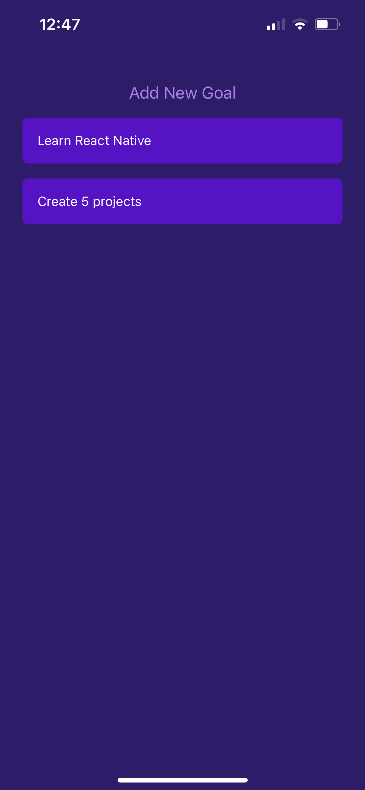
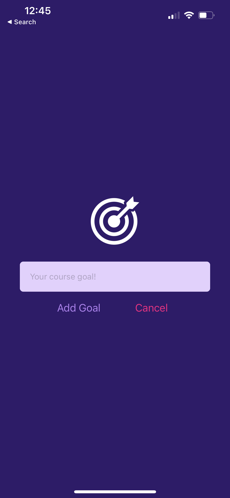

## React Native Goals App

A simple cross platform (iOS and Android) React Native app. A user can add and remove goals from a list.

### Installation

- `git clone git@github.com:glowingmanagement/react-native-goals-list.git`
- `npm install`

### Running

- `npm run ios` or `npm run android`

### Contact

If you have any questions, contact me at: josh@glowingmanagement.com

- View my Github [here](https://www.github.com/glowingmanagement)
- View my LinkedIn [here](https://www.linkedin.com/in/joshholmes22)
- View my Portfolio [here](https://glowingmanagement.github.io/my-portfolio/)

### Screenshots

